# PERPUSTAKAAN

Project studi kasus nyata sistem perpustakaan. Mata kuliah Pemrograman Web 2, menggunakan Bahasa pemrograman PHP, library Laravel, dan Database MySQL

## Tugas 1 (Pertemuan 6) : Eksplorasi Database dengan Query (40%)

### Dokumentasi Hasil Query (Screenshot)

#### 1 Statistik Buku (5 Query)

1.1 Total jumlah buku aktif  
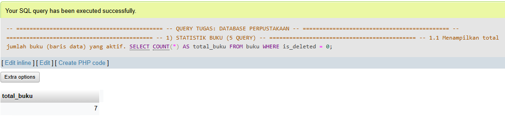

1.2 Total nilai inventaris buku aktif
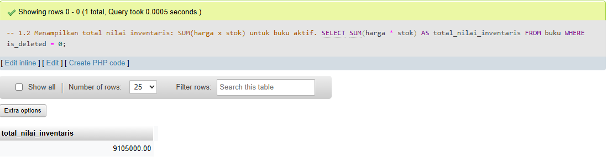

1.3 Rata-rata harga buku aktif  
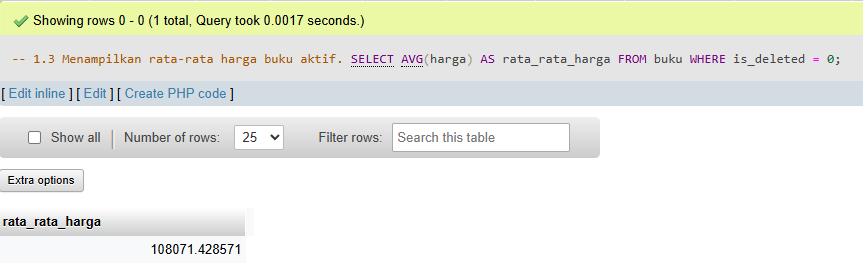

1.4 Buku termahal (judul dan harga)  
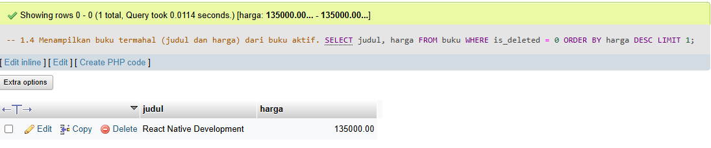

1.5 Buku dengan stok terbanyak  
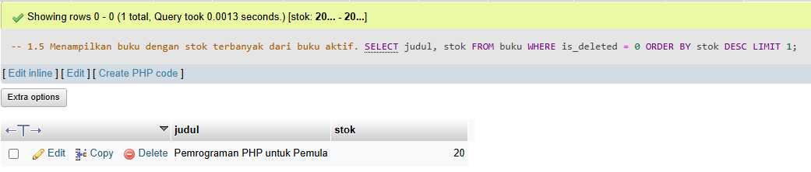

#### 2 Filter dan Pencarian (5 Query)

2.1 Buku kategori Programming dengan harga di bawah 100000  
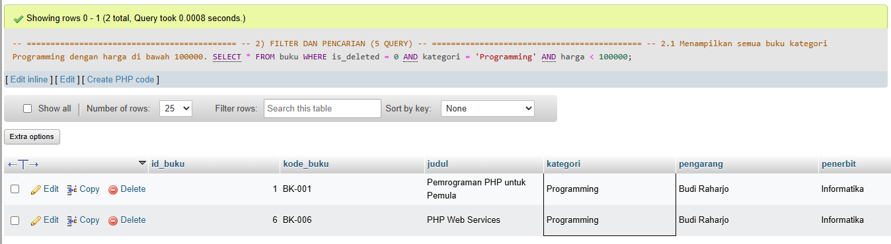

2.2 Buku dengan judul mengandung kata PHP atau MySQL  
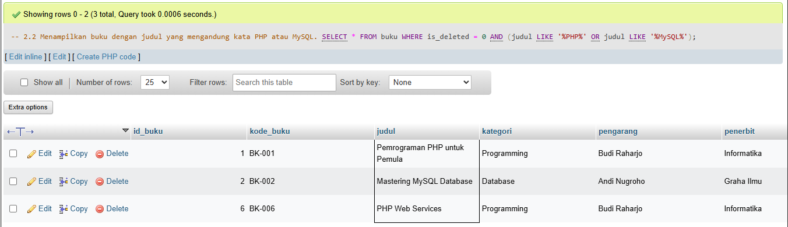

2.3 Buku terbit tahun 2024  
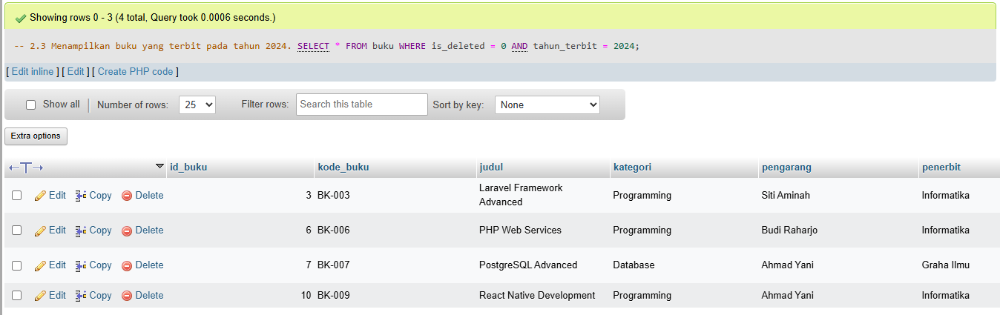

2.4 Buku dengan stok antara 5 sampai 10  
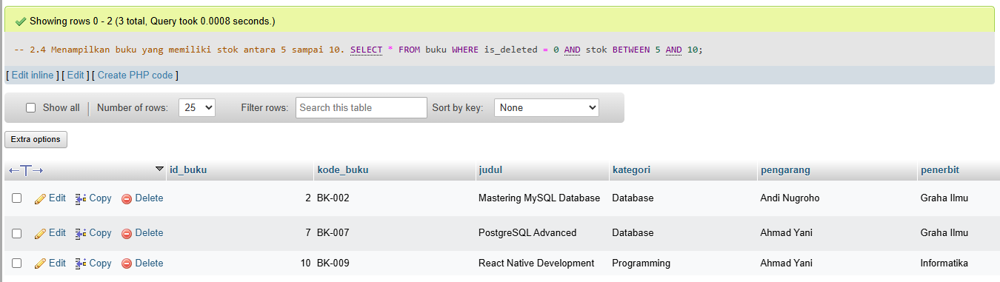

2.5 Buku oleh pengarang Budi Raharjo  
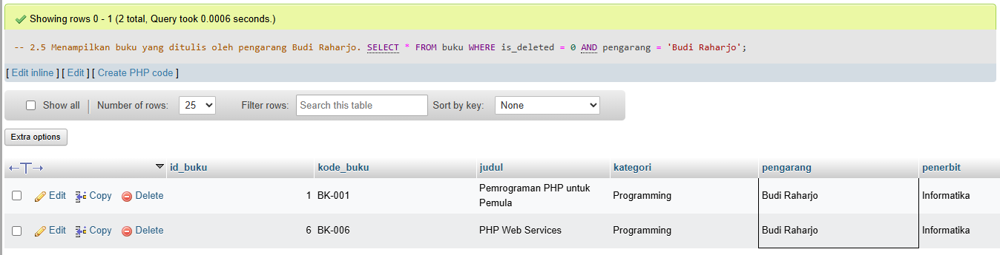

#### 3 Grouping dan Agregasi (3 Query)

3.1 Jumlah judul buku dan total stok per kategori  
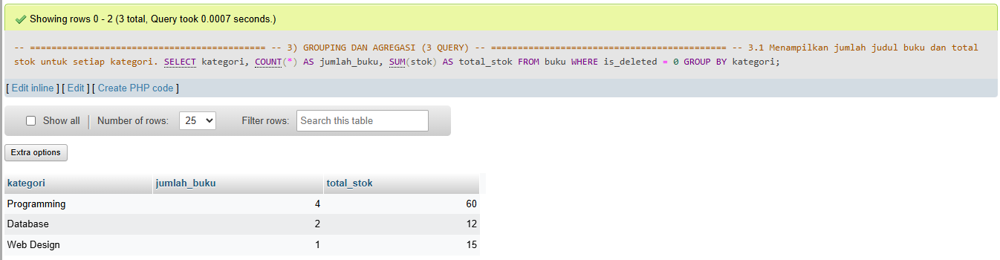

3.2 Rata-rata harga buku per kategori  
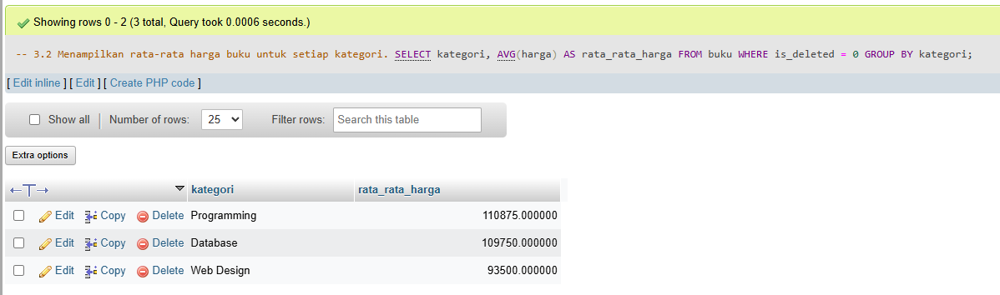

3.3 Kategori dengan total nilai inventaris terbesar  
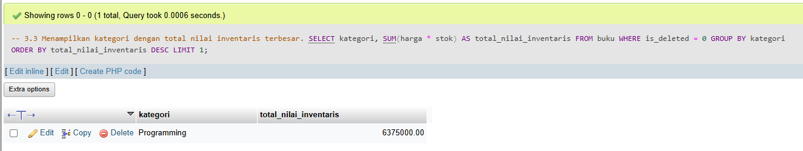

#### 4 Update Data (2 Query)

4.1 Kenaikan harga buku kategori Programming sebesar 5%  
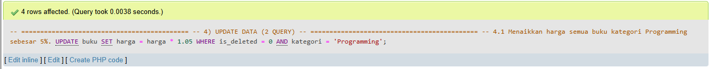

4.2 Penambahan stok 10 untuk buku dengan stok kurang dari 5  
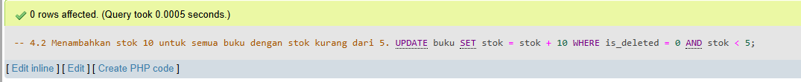

#### 5 Laporan Khusus (2 Query)

5.1 Daftar buku yang perlu restocking (stok < 5)  
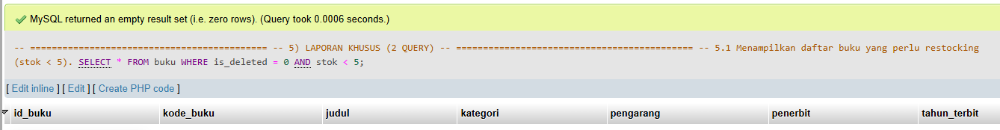

5.2 5 buku termahal dari buku aktif  
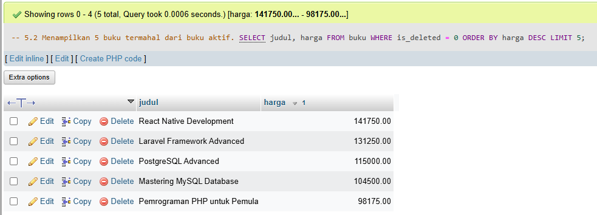

## Tugas 2 (Pertemuan 6) : Desain Database Lengkap (60%)

### ERD

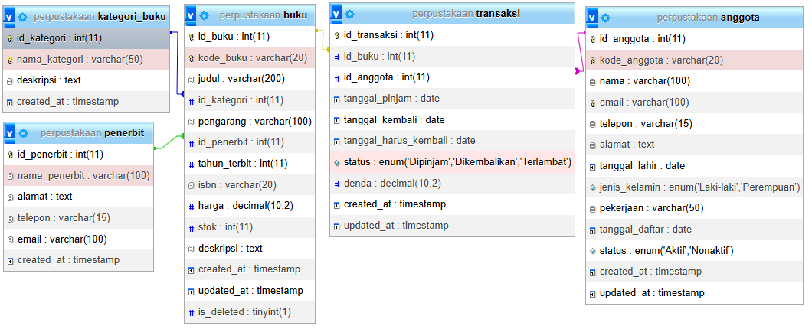

### Screenshot

#### Struktur semua tabel

1. Tabel anggota
   

2. Tabel buku  
   

3. Tabel kategori_buku
   

4. Tabel penerbit  
   
5. Tabel transaksi
   

#### Data di setiap tabel

1. Data tabel anggota  
   

2. Data tabel buku  
   

3. Data tabel kategori_buku  
   

4. Data tabel penerbit  
   

5. Data tabel transaksi  
   

#### Hasil query JOIN

1. Query JOIN 1
    

2. Query JOIN Jumlah Buku Per Kategori  
  

3. Query JOIN Jumlah Buku Per Penerbit  
  

4. Query JOIN Lengkap  
  